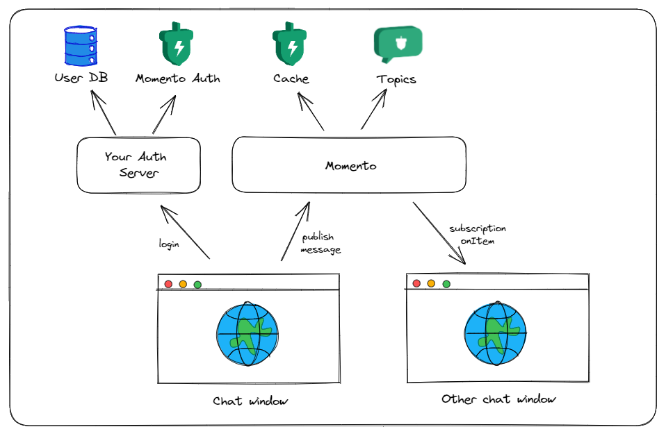

# Momento Chat Application

Momento Chat is a real-time chat application built with Next.js and the Momento SDK. It provides a simple and intuitive chat interface for users to communicate in different chat rooms using [Momento Topics](https://docs.momentohq.com/introduction/momento-topics) as a broadcast WebSocket and [Momento Cache](https://docs.momentohq.com/) as a temporary data store.

## Features

- Real-time communication
- Support for multiple chat rooms
- User authentication*
- Message persistence

## How It Works



## Authentication

Authentication is a crucial part of this application. It ensures that only authorized users can access the chat services, and also provides a mechanism for controlling the scope of actions that a user can perform.

### Token Vending Machine

This example chat application uses a concept known as a Token Vending Machine (TVM) for handling user authentication. In this model, the server generates a temporary authorization token when a user logs in. This token is then passed to the client, which uses it to initialize the Momento SDK.

The temporary authorization token has scoped permissions, meaning it only grants the level of access necessary for the user to perform their intended actions within the application. For instance, a user may be granted permissions to read and write messages in a specific chat room, but not to do administrative tasks like creating or deleting an entire cache.

### Token Expiration

The temporary authorization token has an expiry time of one hour. Once the token expires, the user will need to obtain a new token to continue interacting with the application. This is an important security measure that helps to limit the potential damage if a token is compromised. By ensuring that tokens are short-lived, we reduce the window of opportunity for an attacker to use a stolen token.

By using a combination of a TVM, scoped permissions, and token expiration, we ensure robust and secure user authentication while maintaining a user-friendly experience. This approach strikes a balance between security and usability, allowing users to communicate safely and effectively.

## Installation

Before you can run the application, make sure that you have Node.js installed on your machine. If you don't have Node.js installed, you can download it from [here](https://nodejs.org/).

After cloning the repository, navigate to the project's directory and install the dependencies by running the following command:

```bash
npm install
```

## Running the Application

First, you will need to create your auth mechanism and token vending machine. After you create the auth, you can add a `.env` file to the root directory with an environment variable name of `NEXT_PUBLIC_AUTH_BASE_URL` that contains the base url to your API.

After setting up the environment variables, you can start the application by running the following command:

```bash
npm run dev
```

You should now be able to access the application at `http://localhost:3000`.

## Usage

When you open the application, you will automatically be signed in and issued an auth token. The app will randomly generate a name for you. When you create a new chat room, the chat will receive a randomly generated name from the Periodic Table of Elements (why not?). Enter a chat and type away!
